# DoctorMate - Medical Appointment Booking App

A professional, fully-featured Flutter application for booking medical appointments, teleconsultations, and managing patient healthcare journeys.

## 📱 Project Overview

DoctorMate is a comprehensive medical appointment booking platform that connects patients with healthcare professionals. The app features a modern, user-friendly interface with real-time data integration, advanced state management, secure payment handling, and real-time communication (chat/video calls). It serves as a complete digital healthcare companion for patients.

## 🎥 Video Demo

[](https://www.youtube.com/watch?v=YOUR_YOUTUBE_VIDEO_ID)

## 📸 Screenshots

*(Replace the `src` paths below with the actual paths to your screenshot files)*

<table align="center">
  <tr>
    <td>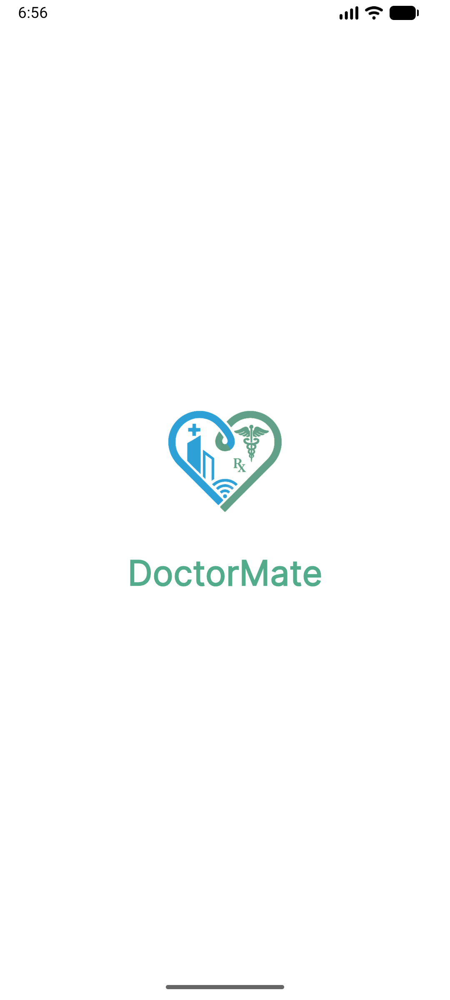</td>
    <td>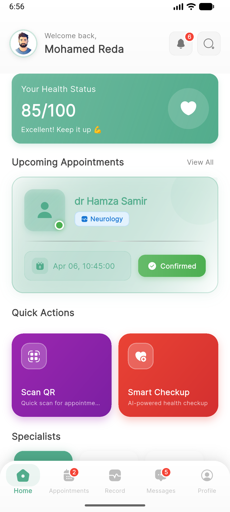</td>
    <td>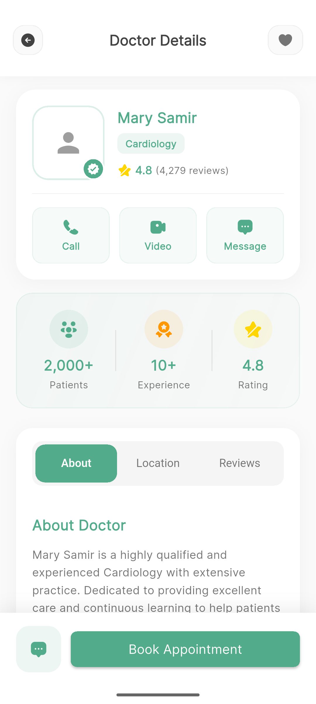</td>
    <td>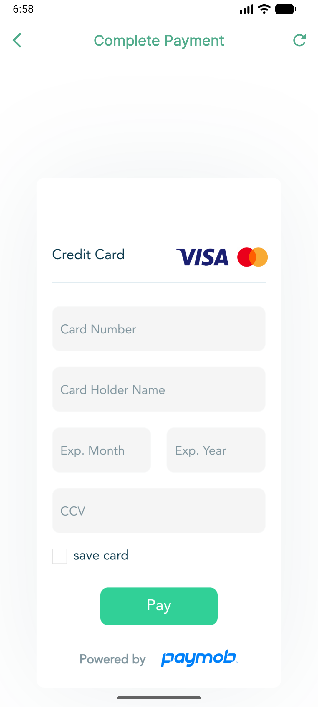</td>
    <td>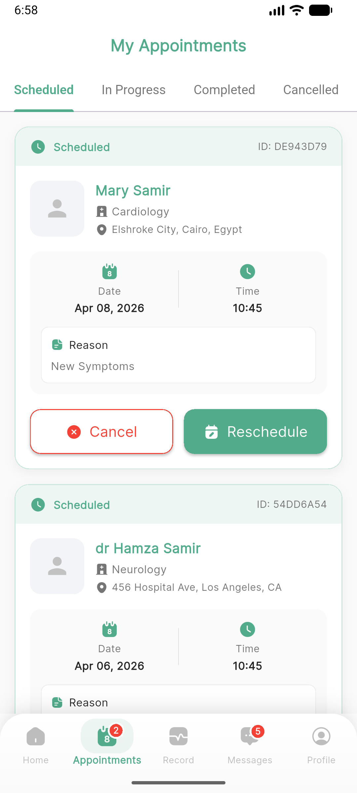</td>
    <td>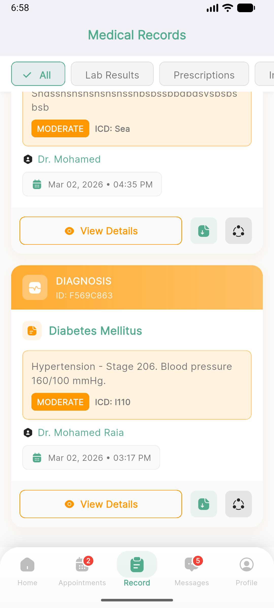</td>
    <td>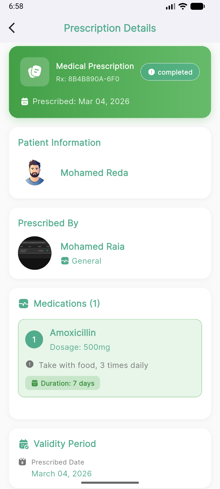</td>
    <td>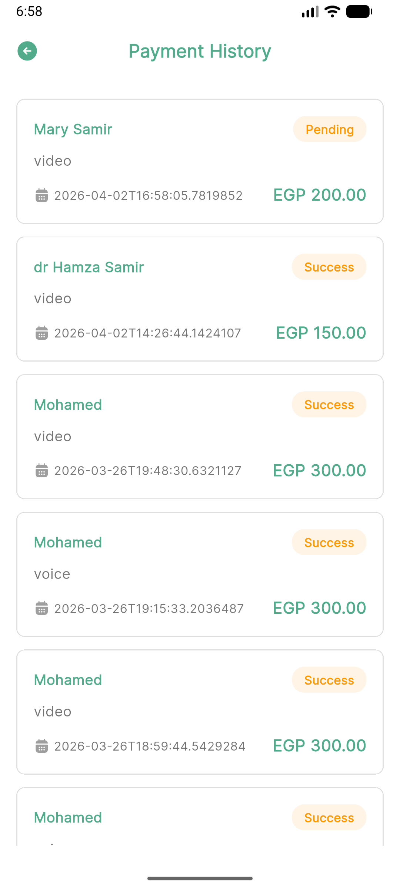</td>
  </tr>
  <tr>
    <td>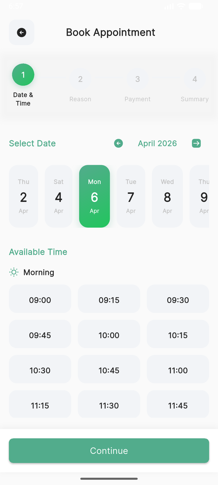</td>
    <td>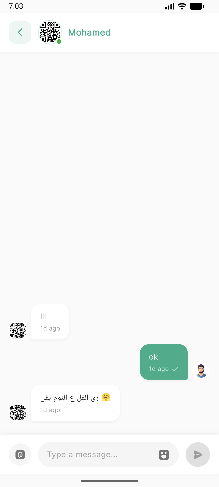</td>
    <td>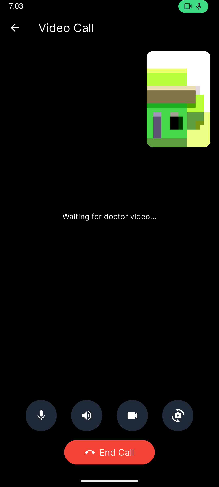</td>
    <td>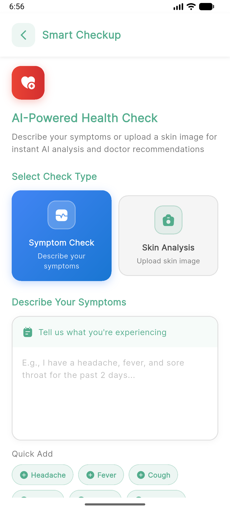</td>
    <td>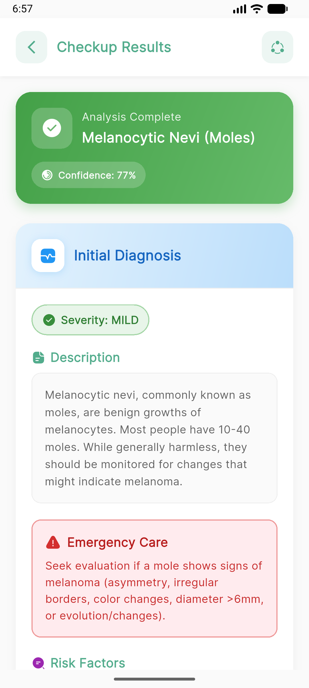</td>
    <td>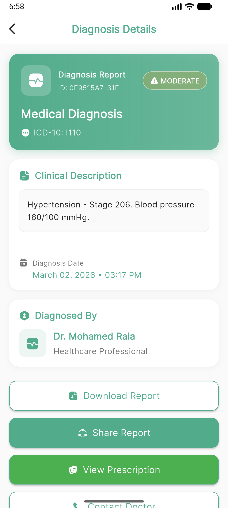</td>
    <td>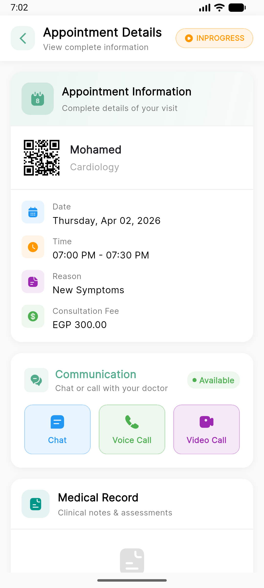</td>
    <td>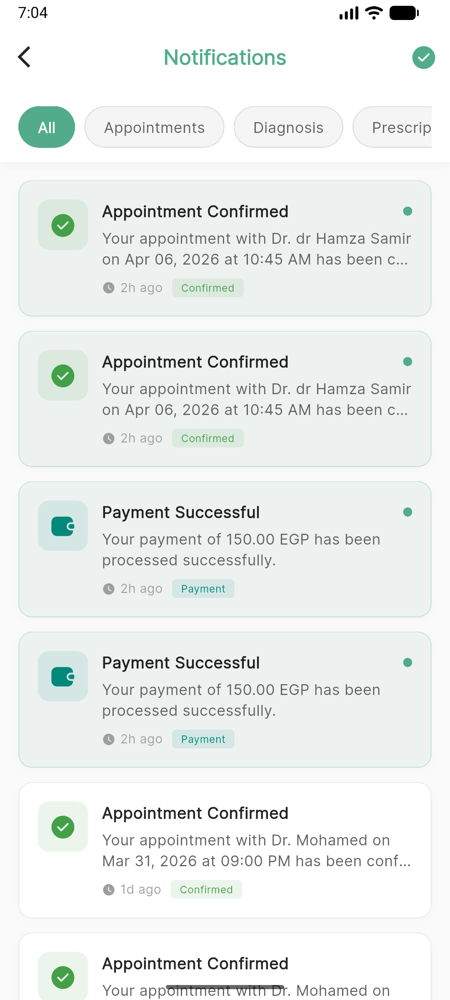</td>
  </tr>
</table>

## ✨ Key Features

### 🔐 Authentication & Security
- **Secure Authentication**: Email/password login and registration.
- **Session Management**: Secure storage for authentication tokens and user identity.
- **Profile Management**: Complete profile setup, image upload, and security settings.

### 🏠 Discovery & Home
- **Smart Doctors Search**: Filter doctors by name, specialty, and availability.
- **Specialties Quick Access**: Browse medical specialties with auto-selected categories.
- **QR Code Scanner**: Full camera integration to instantly find doctors via their QR codes.

### 📅 Appointment Booking System
- **Intelligent Scheduling**: Dynamic calendar filtered by doctors' working days and hours.
- **Consultation Types**: Support for In-Person, Video Call, and Voice Call appointments.
- **Secure Payments**: Integrated payment gateway with options for Credit Card, Digital Wallet, or Cash.
- **Booking Management**: 3-tab interface (Upcoming, Completed, Cancelled) to track all visits.

### 💬 Communication & Telemedicine
- **Real-time Chat**: Firestore-powered instant messaging between patients and doctors.
- **Voice & Video Calls**: Integrated Agora RTC for seamless remote teleconsultations.
- **Call Controls**: Mute, camera toggle, and speaker controls.

### 🤖 Smart Checkup (AI Health Analysis)
- **Symptom Checkup**: AI-powered analysis of user-described symptoms.
- **Skin Analysis**: Upload images for initial AI-driven dermatological assessments.
- **Smart Recommendations**: Suggests relevant medical specialties and doctors based on AI findings.

### 📋 Medical Records & Prescriptions
- **Digital Medical History**: Access diagnoses, lab results, and past appointments.
- **e-Prescriptions**: View prescribed medications, dosages, and instructions.
- **Downloadable Records**: Easily download or share medical documents.

### ⭐ Reviews & Ratings
- **Doctor Reviews**: Provide and read feedback on healthcare professionals.
- **Rating System**: 5-star rating mechanism for past appointments.

### 🔔 Push & In-App Notifications
- **Firebase Cloud Messaging**: Reliable push notifications for appointment updates.
- **Notification Center**: In-app management of all alerts, categorized by read/unread status.
- **Customizable Preferences**: Granular control over which notifications to receive.

## 🏗️ Architecture & State Management

DoctorMate follows **Clean Architecture** principles to separate concerns, improve testability, and ensure scalability. 

- **State Management**: **BLoC/Cubit** pattern with immutable states (`freezed`).
- **Dependency Injection**: `get_it` and `injectable` for robust dependency management.
- **Networking**: `dio` and `retrofit` for type-safe API communication.
- **Routing**: `go_router` for declarative and deep-linkable navigation.

```text
lib/
├── core/
│   ├── di/                 # Dependency Injection
│   ├── networking/         # API configuration (Retrofit, Dio)
│   ├── routing/            # Navigation structure
│   ├── services/           # External services (Firebase, Agora)
│   └── theme/              # App theme, typography & styling
├── features/
│   ├── auth/               # Authentication flows
│   ├── home/               # Dashboard and discovery
│   ├── appointment/        # Booking and scheduling
│   ├── chat/               # Messaging and video calls
│   ├── profile/            # User settings and medical history
│   ├── notifications/      # FCM and in-app alerts
│   └── ...                 # Other modular features
└── main.dart
`````
## 🛠️ Tech Stack & Dependencies

- **Framework**: Flutter (Dart)
- **Networking**: Dio, Retrofit, JSON Serializable
- **State Management**: Flutter BLoC, Freezed
- **Local Storage**: Shared Preferences, Flutter Secure Storage
- **UI & Animations**: Flutter ScreenUtil, Shimmer, Lottie, Cached Network Image
- **Telemedicine & Chat**: Agora RTC Engine, Cloud Firestore
- **Hardware Integration**: Mobile Scanner (QR), Image Picker, URL Launcher

## 🚀 Getting Started

### Prerequisites
- Flutter SDK (3.0.0 or higher)
- Target devices: Android Emulator, iOS Simulator, or physical devices
- Firebase Project configured (for Authentication, Firestore, and FCM)
- Agora Developer Account (for video/voice calls)

### Installation

1. **Clone the repository**
```bash
git clone https://github.com/DoctorMate-Team/doctormate-mobile.git
cd doctormate-mobile
```
2. **Install dependencies**
```bash
flutter pub get
```
3. **Generate required files**
```bash
dart run build_runner build --delete-conflicting-outputs
```
4. **Run the app**
```bash
flutter run
```
## 🎨 Design System & UI/UX
- **Responsive Layout**: Adapts seamlessly to different screen sizes via `flutter_screenutil`.
- **Loading States**: Custom shimmer layouts match the shape of the content to prevent layout shifts.
- **Visual Feedback**: Smooth transitions, snackbars, and Lottie animations guide the user experience.

## 📄 License
This project is proprietary software owned by the DoctorMate Team.

## 👥 Team
- **Development Team**: DoctorMate-Team
- **Repository**: [doctormate-mobile](https://github.com/DoctorMate-Team/doctormate-mobile)


